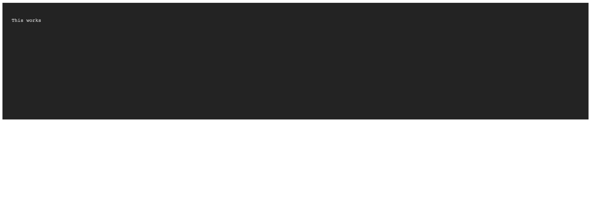

# yLog

This is a simplified version of [`min-log`](https://github.com/chunpu/min-log) with `log.setOutputer('browser_html')` setup (But slightly different)

Targeting ancient IE (6+) and desktop webview.



## Installation

```bash
npm i -D @y/log
# or
yarn add -D @y/log
```

## Usage

```js
import log from "@y/log";
log.log("This works");
// or
import "@y/log";
console.log("This also works");
```

> If no bundling tool (`webpack`, `parcel` etc) is available for your workflow, just include [this](./dist/index.js) to the your html file, and use `console.log` as usual.

## API

### `log`

Interface

```ts
log.log = (input: string, safeMode: boolean = false) => void
```

Usage

```js
log.log("string");
log.log("string", true);
```

If set `safeMode` to `true`, then we will make sure the container (`<div />`) of the log exists, or one will be created.
